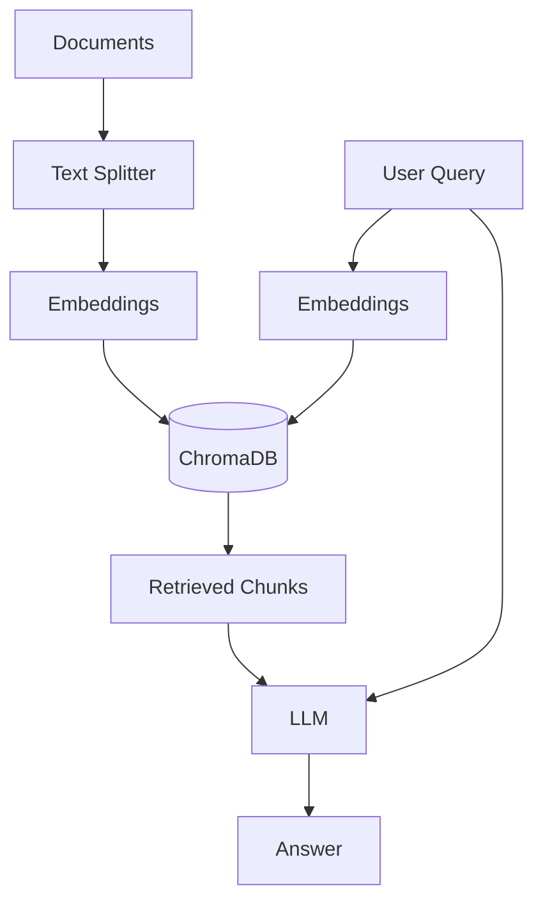

# Naive RAG

Basic Retrieval-Augmented Generation pipeline - the foundation of all RAG architectures.

## Theory

### What is Naive RAG?

Naive RAG is the simplest form of RAG, following a straightforward pipeline:

```
Query -> Retrieve -> Generate -> Answer
```

### How It Works

1. **Indexing Phase:**
   - Load documents (PDF, TXT, etc.)
   - Split into chunks
   - Generate embeddings
   - Store in vector database

2. **Retrieval Phase:**
   - Convert query to embedding
   - Find similar chunks using cosine similarity
   - Return top-k results

3. **Generation Phase:**
   - Combine retrieved context with query
   - Pass to LLM for answer generation

### Key Concepts

- **Chunking:** Splitting documents into manageable pieces
- **Embeddings:** Converting text to numerical vectors
- **Similarity Search:** Finding relevant chunks using vector distance
- **Context Window:** Amount of text the LLM can process

## Architecture



## Quick Start

### Prerequisites
- Python 3.11+
- uv (package manager)
- Docker (for ChromaDB)
- Ollama (for LLM)

### Setup

```bash
# Install dependencies
make setup

# Start infrastructure
make infra-up PROJECT=01-naive-rag

# Run the application
make run
```

## File Structure

```
01-naive-rag/
├── main.py           # Main RAG implementation
├── config.py         # Configuration settings
├── pyproject.toml    # Project dependencies
├── Makefile          # Project commands
├── services.yaml     # Required services
├── README.md         # This file
└── data/             # Document storage
    └── sample.pdf    # Example document
```

## Configuration

Edit `config.py` to customize:

```python
@dataclass
class RAGConfig:
    ollama_base_url: str = "http://localhost:11434"
    llm_model: str = "llama3"
    embedding_model: str = "all-minilm:latest"
    chunk_size: int = 1000
    chunk_overlap: int = 200
    top_k: int = 4
```

## Performance

| Metric | Value |
|--------|-------|
| Indexing Speed | ~100 docs/min |
| Query Latency | ~2-5 seconds |
| Accuracy | Baseline for comparison |

## Comparison with Other RAG Types

| Feature | Naive RAG | HyDE | Corrective | Graph |
|---------|-----------|------|------------|-------|
| Complexity | Low | Medium | High | High |
| Query Transform | No | Yes | Yes | Yes |
| Self-Correction | No | No | Yes | No |
| Accuracy | Baseline | +10-15% | +15-20% | +20-25% |

## Learning Resources

- [LangChain Documentation](https://python.langchain.com/docs/)
- [ChromaDB Documentation](https://docs.trychroma.com/)
- [RAG Survey Paper](https://arxiv.org/abs/2312.10997)

## Troubleshooting

### Issue: Connection refused to ChromaDB
```bash
# Check if ChromaDB is running
docker ps | grep chromadb

# Restart if needed
make infra-down
make infra-up PROJECT=01-naive-rag
```

### Issue: Ollama model not found
```bash
# Pull the model manually
docker exec rag-mastery-ollama ollama pull llama3
```
