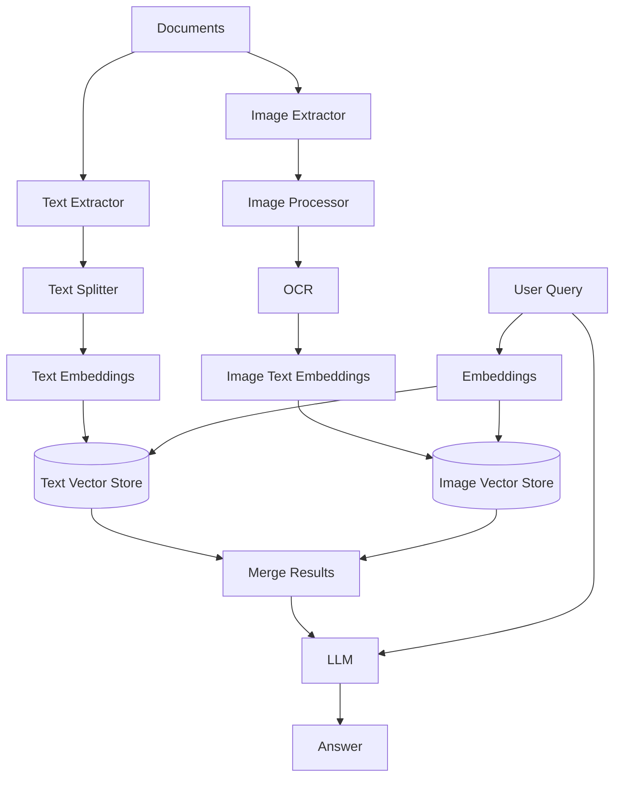

# Multimodal RAG

Handle text, images, and tables in your RAG pipeline.

## Theory

### What is Multimodal RAG?

Multimodal RAG extends traditional RAG to handle multiple data types:
- Text documents (PDFs, TXT, Markdown)
- Images (PNG, JPG, diagrams)
- Tables (extracted from PDFs)
- Mixed content (documents with both text and images)

### How It Works

1. **Document Processing:**
   - Extract text from PDFs and documents
   - Extract images from PDFs
   - OCR for text in images

2. **Multimodal Embeddings:**
   - Text embeddings using sentence-transformers
   - Image descriptions using vision models

3. **Hybrid Retrieval:**
   - Search across text and image collections
   - Weighted scoring for different modalities

### Key Concepts

- **OCR:** Optical Character Recognition for extracting text from images
- **Vision Models:** Models like LLaVA that can understand images
- **Multimodal Embeddings:** Representing different modalities in the same space

## Architecture



## Quick Start

### Prerequisites
- Python 3.11+
- uv (package manager)
- Docker (for ChromaDB)
- Ollama (for LLM and vision models)
- Tesseract (for OCR)

### Setup

```bash
# Install system dependencies (Ubuntu/Debian)
sudo apt-get install tesseract-ocr

# Install Python dependencies
make setup

# Start infrastructure
make infra-up PROJECT=02-multimodal-rag

# Pull vision model
docker exec rag-mastery-ollama ollama pull llava

# Run the application
make run
```

## File Structure

```
02-multimodal-rag/
├── main.py           # Main RAG implementation
├── config.py         # Configuration settings
├── pyproject.toml    # Project dependencies
├── Makefile          # Project commands
├── services.yaml     # Required services
├── README.md         # This file
└── data/
    ├── documents/    # PDF and text files
    └── images/       # Image files
```

## Configuration

Edit `config.py` to customize:

```python
@dataclass
class MultimodalRAGConfig:
    vision_model: str = "llava:latest"
    ocr_enabled: bool = True
    text_weight: float = 0.7
    image_weight: float = 0.3
```

## Performance

| Metric | Text Only | With Images |
|--------|-----------|-------------|
| Indexing Speed | ~100 docs/min | ~50 docs/min |
| Query Latency | ~2-5s | ~3-7s |
| Accuracy | Baseline | +15-20% |

## Troubleshooting

### Issue: OCR not working
```bash
# Install Tesseract
sudo apt-get install tesseract-ocr

# Verify installation
tesseract --version
```

### Issue: Vision model not available
```bash
# Pull LLaVA model
docker exec rag-mastery-ollama ollama pull llava
```

## License

MIT License
