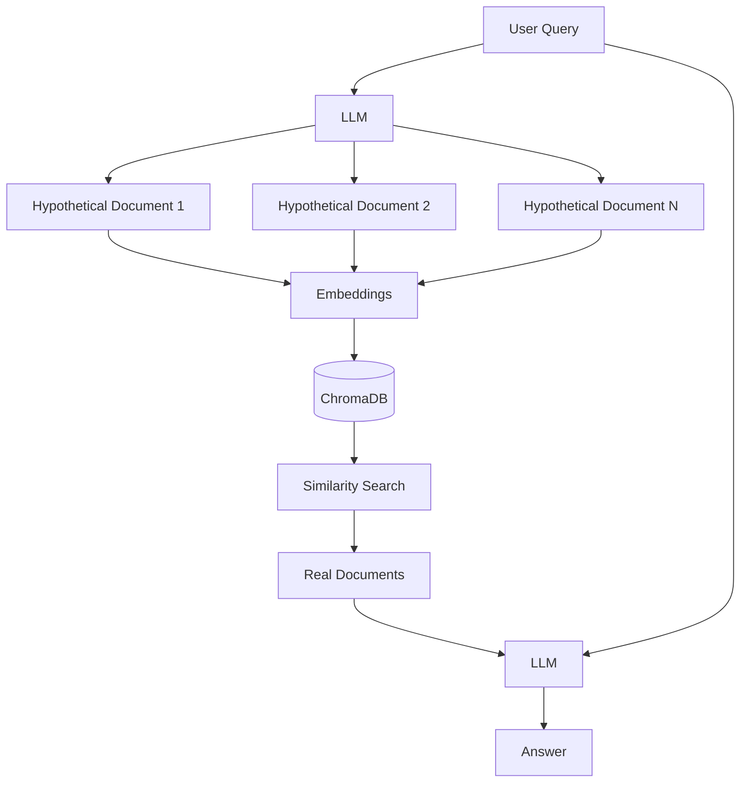

# HyDE RAG

Hypothetical Document Embeddings - generate hypothetical answers before retrieving.

## Theory

### What is HyDE?

HyDE (Hypothetical Document Embeddings) is a technique where instead of directly embedding the query, we:
1. Generate a hypothetical document/answer
2. Embed the hypothetical document
3. Retrieve real documents similar to the hypothetical one

### Why HyDE?

Traditional problems with direct query embedding:
- Queries are short and may not capture full intent
- Embedding space mismatch between queries and documents
- Limited context in the query itself

HyDE solves this by:
- Generating a full document that would answer the question
- Using this document's embedding for retrieval
- Capturing more semantic meaning

### How It Works

```
Query -> LLM -> Hypothetical Document -> Embedding -> Similarity Search -> Real Documents
```

### Multi-HyDE

Multi-HyDE generates multiple hypothetical documents to:
- Capture different aspects of the query
- Reduce bias from a single generation
- Improve retrieval recall

## Architecture



## Quick Start

### Prerequisites
- Python 3.11+
- uv (package manager)
- Docker (for ChromaDB)
- Ollama (for LLM)

### Setup

```bash
# Install dependencies
make setup

# Start infrastructure
make infra-up PROJECT=03-hyde-rag

# Run the application
make run
```

## File Structure

```
03-hyde-rag/
├── main.py           # HyDE RAG implementation
├── config.py         # Configuration settings
├── pyproject.toml    # Project dependencies
├── Makefile          # Project commands
├── services.yaml     # Required services
├── README.md         # This file
└── data/             # Document storage
```

## Configuration

Edit `config.py` to customize:

```python
@dataclass
class HyDEConfig:
    hyde_temperature: float = 0.7
    num_hypothetical_docs: int = 3
    use_multi_hyde: bool = True
    score_threshold: float = 0.5
```

## Comparison: Naive vs HyDE

| Metric | Naive RAG | HyDE |
|--------|-----------|------|
| Query Processing | Direct embedding | Generate + embed |
| Retrieval Quality | Baseline | +10-15% |
| Latency | ~2-5s | ~4-8s |
| Best For | Simple queries | Complex questions |

## Troubleshooting

### Issue: Low quality hypothetical documents
```python
# Adjust temperature in config.py
config = HyDEConfig(hyde_temperature=0.5)  # Lower = more focused
```

### Issue: Slow retrieval with Multi-HyDE
```python
# Reduce number of hypothetical docs
config = HyDEConfig(num_hypothetical_docs=2)
```

## License

MIT License