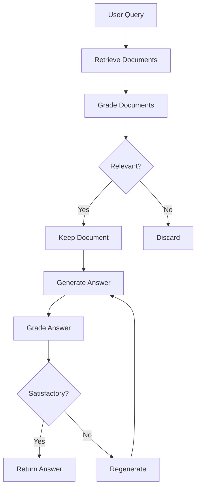

# Corrective RAG

Self-correcting retrieval with document validation and quality checks.

## Theory

### What is Corrective RAG?

Corrective RAG adds validation and self-correction to the RAG pipeline:
1. Grade document relevance
2. Filter low-quality documents
3. Validate answer quality
4. Regenerate if needed

### Why Corrective RAG?

Problems with basic RAG:
- Retrieved documents may not be relevant
- Generated answers may not use context well
- No quality assurance mechanism

Corrective RAG solves this with:
- Document relevance grading
- Answer quality checking
- Self-correction loops

### How It Works

```
Query -> Retrieve -> Grade Documents -> Filter -> Generate -> Grade Answer -> Accept/Regenerate
```

### Key Concepts

- **Document Grading:** Score relevance of each document
- **Self-RAG:** Validate answer quality before returning
- **Correction Loops:** Retry with refined queries

## Architecture



## Quick Start

### Prerequisites
- Python 3.11+
- uv (package manager)
- Docker (for ChromaDB)
- Ollama (for LLM)

### Setup

```bash
# Install dependencies
make setup

# Start infrastructure
make infra-up PROJECT=04-corrective-rag

# Run the application
make run
```

## File Structure

```
04-corrective-rag/
├── pyproject.toml          # Project dependencies and scripts
├── Makefile                # Project commands
├── services.yaml           # Required services
├── README.md               # This file
├── .env.example            # Environment configuration template
├── src/
│   └── corrective_rag/
│       ├── __init__.py
│       ├── __main__.py     # Entry point for python -m
│       ├── config.py       # Configuration management
│       ├── exceptions.py   # Custom exceptions
│       ├── models/
│       │   ├── __init__.py
│       │   └── schemas.py  # Pydantic data models
│       ├── services/
│       │   ├── __init__.py
│       │   ├── document_loader.py  # Document loading
│       │   ├── embeddings.py       # Embedding generation
│       │   ├── vector_store.py     # Vector store operations
│       │   ├── grader.py          # Document and answer grading
│       │   ├── generator.py       # Answer generation
│       │   └── retriever.py       # Corrective retrieval
│       ├── pipelines/
│       │   ├── __init__.py
│       │   └── corrective.py      # Main RAG pipeline
│       └── cli/
│           ├── __init__.py
│           └── app.py             # CLI application
├── tests/
│   ├── conftest.py        # Pytest fixtures
│   ├── unit/
│   │   └── test_config.py
│   └── integration/
│       └── test_pipeline.py
└── data/
    └── .gitkeep
```

## Configuration

Edit `.env` or use environment variables:

```bash
# Corrective settings
CORRECTIVE_RAG_RELEVANCE_THRESHOLD=0.7
CORRECTIVE_RAG_MAX_CORRECTION_ATTEMPTS=3
CORRECTIVE_RAG_USE_GRADING=true
CORRECTIVE_RAG_USE_SELF_RAG=true

# Retrieval settings
CORRECTIVE_RAG_TOP_K=4
CORRECTIVE_RAG_INITIAL_RETRIEVAL_K=8
```

Or modify `src/corrective_rag/config.py`:

```python
class Settings(BaseSettings):
    relevance_threshold: float = 0.7
    max_correction_attempts: int = 3
    use_grading: bool = True
    use_self_rag: bool = True
    initial_retrieval_k: int = 8
```

## Comparison

| Metric | Naive RAG | Corrective RAG |
|--------|-----------|----------------|
| Retrieval Quality | Baseline | +15-20% |
| Answer Quality | Baseline | +10-15% |
| Latency | ~2-5s | ~5-10s |
| Accuracy | ~70% | ~85% |

## Troubleshooting

### Issue: Too many documents filtered out
```bash
# Lower the relevance threshold
CORRECTIVE_RAG_RELEVANCE_THRESHOLD=0.5 make run
```

### Issue: Slow due to too many correction attempts
```bash
# Reduce max attempts
CORRECTIVE_RAG_MAX_CORRECTION_ATTEMPTS=2 make run
```

## License

MIT License
