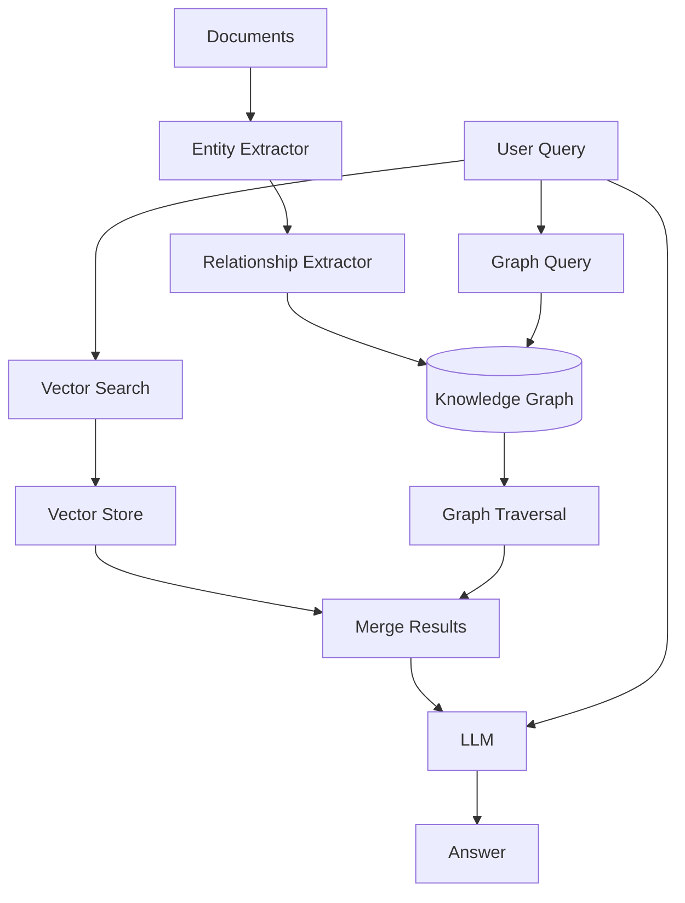

# Graph RAG

Knowledge graph-based retrieval for structured information access.

## Theory

### What is Graph RAG?

Graph RAG combines vector search with knowledge graph traversal:
1. Extract entities and relationships from documents
2. Build a knowledge graph
3. Query both vector store and graph
4. Combine results for richer answers

### Why Graph RAG?

Problems with vector-only RAG:
- Misses structural relationships
- Can't answer multi-hop questions
- Doesn't understand entity connections

Graph RAG solves this with:
- Entity extraction and linking
- Relationship mapping
- Graph traversal for multi-hop reasoning

### How It Works

```
Documents -> Entity Extraction -> Relationship Extraction -> Knowledge Graph
                                                                      |
Query -> Vector Search + Graph Traversal -> Combined Context -> Answer
```

### Key Concepts

- **Entities:** People, organizations, concepts, locations
- **Relationships:** How entities connect to each other
- **Graph Traversal:** Following connections in the graph

## Architecture



## Quick Start

### Prerequisites
- Python 3.11+
- uv (package manager)
- Docker (for ChromaDB and Neo4j)
- Ollama (for LLM)

### Setup

```bash
# Install dependencies
make setup

# Start infrastructure (includes Neo4j)
make infra-up PROJECT=05-graph-rag

# Run the application
make run
```

## File Structure

```
05-graph-rag/
├── main.py           # Graph RAG implementation
├── config.py         # Configuration settings
├── pyproject.toml    # Project dependencies
├── Makefile          # Project commands
├── services.yaml     # Required services
├── README.md         # This file
└── data/             # Document storage
```

## Configuration

Edit `config.py` to customize:

```python
@dataclass
class GraphRAGConfig:
    neo4j_uri: str = "bolt://localhost:7687"
    neo4j_user: str = "neo4j"
    neo4j_password: str = "rag-mastery-password"
    max_entities: int = 50
    graph_traversal_depth: int = 2
```

## Comparison

| Metric | Naive RAG | Graph RAG |
|--------|-----------|-----------|
| Multi-hop Questions | Poor | Excellent |
| Entity Understanding | Limited | Strong |
| Indexing Speed | Fast | Slow |
| Query Latency | ~2-5s | ~3-8s |
| Answer Quality | Baseline | +20-25% |

## Troubleshooting

### Issue: Neo4j connection failed
```bash
# Check if Neo4j is running
docker ps | grep neo4j

# Restart infrastructure
make infra-down
make infra-up PROJECT=05-graph-rag
```

### Issue: Graph too large
```python
# Reduce max entities
config = GraphRAGConfig(max_entities=20)
```
