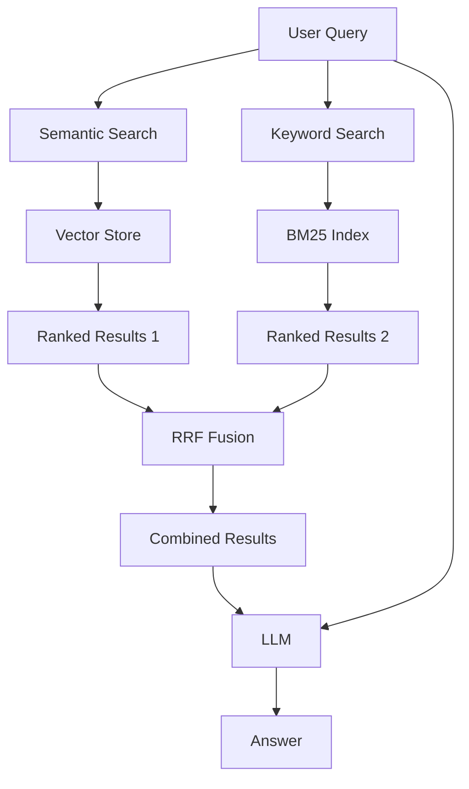

# Hybrid RAG

Combined keyword and semantic search with Reciprocal Rank Fusion.

## Theory

### What is Hybrid RAG?

Hybrid RAG combines two search approaches:
1. **Keyword Search (BM25):** Traditional term-based matching
2. **Semantic Search:** Vector-based meaning matching

### Why Hybrid RAG?

Each approach has strengths:
- **BM25:** Great for exact terms, names, technical terms
- **Semantic:** Great for synonyms, related concepts, meaning

Hybrid RAG gets the best of both worlds.

### Reciprocal Rank Fusion (RRF)

RRF combines rankings from multiple sources:
```
RRF_score(d) = Sum 1/(k + rank_i(d))
```

Where:
- `d` is a document
- `rank_i(d)` is the rank of document `d` in source `i`
- `k` is a constant (usually 60)

### How It Works

```
Query -> Semantic Search -> Ranked Results 1
     -> Keyword Search  -> Ranked Results 2
     -> RRF Fusion      -> Combined Results -> LLM -> Answer
```

## Architecture



## Quick Start

### Prerequisites
- Python 3.11+
- uv (package manager)
- Docker (for ChromaDB)
- Ollama (for LLM)

### Setup

```bash
# Install dependencies
make setup

# Start infrastructure
make infra-up PROJECT=06-hybrid-rag

# Run the application
make run
```

## File Structure

```
06-hybrid-rag/
├── main.py           # Hybrid RAG implementation
├── config.py         # Configuration settings
├── pyproject.toml    # Project dependencies
├── Makefile          # Project commands
├── services.yaml     # Required services
├── README.md         # This file
└── data/             # Document storage
```

## Configuration

Edit `config.py` to customize:

```python
@dataclass
class HybridRAGConfig:
    semantic_weight: float = 0.6
    keyword_weight: float = 0.4
    use_rrf: bool = True
    rrf_k: int = 60
```

## Comparison

| Metric | Naive RAG | Hybrid RAG |
|--------|-----------|------------|
| Exact Match | Good | Excellent |
| Synonym Handling | Good | Excellent |
| Indexing Speed | Fast | Medium |
| Query Latency | ~2-5s | ~3-7s |
| Overall Quality | Baseline | +10-15% |

## Troubleshooting

### Issue: BM25 not finding results
```python
# Adjust BM25 parameters
config = HybridRAGConfig(bm25_k1=2.0, bm25_b=0.8)
```

### Issue: RRF not improving results
```python
# Try weighted fusion instead
config = HybridRAGConfig(use_rrf=False)
```

## License

MIT License
