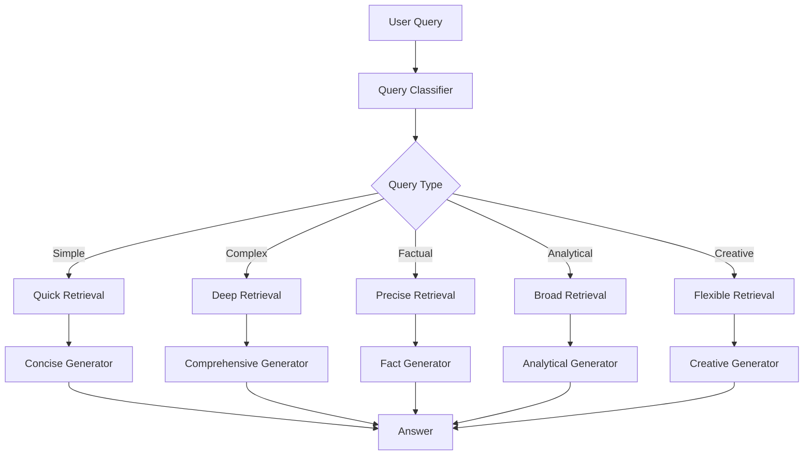

# Adaptive RAG

Dynamic strategy routing based on query type.

## Theory

### What is Adaptive RAG?

Adaptive RAG dynamically adjusts its retrieval and generation strategy based on the type of query:
- Simple questions get fast, direct retrieval
- Complex questions get comprehensive, multi-step retrieval
- Factual questions focus on precision
- Analytical questions focus on breadth
- Creative questions allow more flexibility

### Why Adaptive RAG?

One-size-fits-all RAG has limitations:
- Simple questions waste resources on heavy retrieval
- Complex questions get insufficient context
- No optimization for different query types

Adaptive RAG solves this with:
- Query classification
- Strategy routing
- Type-specific generation

### Query Types

| Type | Description | Strategy |
|------|-------------|----------|
| SIMPLE | Basic factual questions | Quick retrieval, concise answer |
| COMPLEX | Multi-part questions | Deep retrieval, comprehensive answer |
| FACTUAL | Who, what, when, where | Precise retrieval, fact-focused |
| ANALYTICAL | Analysis and comparison | Broad retrieval, analytical answer |
| CREATIVE | Open-ended questions | Flexible retrieval, creative answer |

### How It Works

```
Query -> Classify -> Route -> Retrieve (type-specific) -> Generate (type-specific) -> Answer
```

## Architecture



## Quick Start

### Prerequisites
- Python 3.11+
- uv (package manager)
- Docker (for ChromaDB)
- Ollama (for LLM)

### Setup

```bash
# Install dependencies
make setup

# Start infrastructure
make infra-up PROJECT=07-adaptive-rag

# Run the application
make run
```

## File Structure

```
07-adaptive-rag/
├── main.py           # Adaptive RAG implementation
├── config.py         # Configuration settings
├── pyproject.toml    # Project dependencies
├── Makefile          # Project commands
├── services.yaml     # Required services
├── README.md         # This file
└── data/             # Document storage
```

## Configuration

Edit `config.py` to customize:

```python
@dataclass
class AdaptiveRAGConfig:
    use_query_classification: bool = True
    confidence_threshold: float = 0.7
    retrieval_config: dict = {
        QueryType.SIMPLE: {"top_k": 2, "use_hyde": False},
        QueryType.COMPLEX: {"top_k": 6, "use_hyde": True},
        # ...
    }
```

## Comparison

| Metric | Naive RAG | Adaptive RAG |
|--------|-----------|--------------|
| Simple Queries | Good | Excellent |
| Complex Queries | Poor | Excellent |
| Latency | Fixed | Adaptive |
| Resource Usage | Fixed | Optimized |
| Overall Quality | Baseline | +15-20% |

## Troubleshooting

### Issue: Wrong query classification
```python
# Adjust confidence threshold
config = AdaptiveRAGConfig(confidence_threshold=0.6)
```

### Issue: Too few results for complex queries
```python
# Increase top_k for complex queries
config = AdaptiveRAGConfig(retrieval_config={
    QueryType.COMPLEX: {"top_k": 10, "use_hyde": True},
})
```

## License

MIT License
