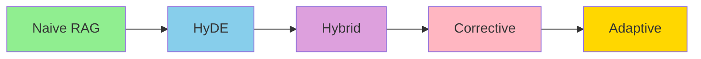

# RAG Mastery

A comprehensive learning repository implementing 7 different Retrieval-Augmented Generation (RAG) architectures with production-ready infrastructure.

## Projects

| # | Project | Description | Complexity | Key Features | Services |
|---|---------|-------------|------------|--------------|----------|
| 01 | Naive RAG | Basic retrieve-and-generate pipeline | Low | Query → Retrieve → Generate | ChromaDB, Ollama |
| 02 | Multimodal RAG | Handle text, images, and tables | Medium | OCR, Vision models, Multi-vector search | ChromaDB, Ollama |
| 03 | HyDE RAG | Hypothetical Document Embeddings | Medium | Query transformation, Multi-HyDE | ChromaDB, Ollama |
| 04 | Corrective RAG | Self-correcting retrieval pipeline | High | Document grading, Self-RAG, Correction loops | ChromaDB, Ollama |
| 05 | Graph RAG | Knowledge graph-based retrieval | High | Entity extraction, Graph traversal, Multi-hop | ChromaDB, Ollama, Neo4j |
| 06 | Hybrid RAG | Combined keyword + semantic search | Medium | BM25, RRF Fusion, Weighted scoring | ChromaDB, Ollama |
| 07 | Adaptive RAG | Dynamic strategy routing | High | Query classification, Strategy routing | ChromaDB, Ollama |

## Quick Start

### Prerequisites

- Python 3.11+
- [uv](https://docs.astral.sh/uv/) (package manager)
- [Docker](https://docs.docker.com/get-docker/) (for infrastructure)
- [Terraform](https://developer.hashicorp.com/terraform/install) (for IaC)
- [Ollama](https://ollama.ai/) (for local LLM inference)

### Installation

```bash
# Install uv
curl -LsSf https://astral.sh/uv/install.sh | sh

# Clone the repository
git clone https://github.com/yourusername/rag-mastery.git
cd rag-mastery

# Initialize infrastructure
make infra-init

# Start services for a specific project
make infra-up PROJECT=01-naive-rag

# Setup project dependencies
make setup PROJECT=01-naive-rag

# Run the project
make run PROJECT=01-naive-rag
```

## Learning Path

Follow this recommended learning progression:

1. **Naive RAG** (01) - Understand basic RAG concepts and pipeline
2. **HyDE RAG** (03) - Learn query transformation techniques
3. **Multimodal RAG** (02) - Handle different data types (text, images, tables)
4. **Corrective RAG** (04) - Implement quality assurance and self-correction
5. **Graph RAG** (05) - Explore structured knowledge and multi-hop reasoning
6. **Hybrid RAG** (06) - Combine multiple search approaches with RRF
7. **Adaptive RAG** (07) - Master dynamic strategy routing

## Architecture Comparison

### Retrieval Quality vs Complexity



### Feature Matrix

| Feature | Naive | Multimodal | HyDE | Corrective | Graph | Hybrid | Adaptive |
|---------|-------|------------|------|------------|-------|--------|----------|
| Query Transformation | ✗ | ✗ | ✓ | ✓ | ✓ | ✗ | ✓ |
| Self-Correction | ✗ | ✗ | ✗ | ✓ | ✗ | ✗ | ✓ |
| Multiple Data Types | ✗ | ✓ | ✗ | ✗ | ✗ | ✗ | ✗ |
| Knowledge Graph | ✗ | ✗ | ✗ | ✗ | ✓ | ✗ | ✗ |
| Hybrid Search | ✗ | ✗ | ✗ | ✗ | ✗ | ✓ | ✓ |
| Dynamic Routing | ✗ | ✗ | ✗ | ✗ | ✗ | ✗ | ✓ |
| Complexity | Low | Medium | Medium | High | High | Medium | High |

## Infrastructure

This project uses **Terraform** to manage Docker containers centrally. Each project declares its required services in `services.yaml`.

### Available Services

| Service | Description | Default Port |
|---------|-------------|--------------|
| ChromaDB | Vector database | 8000 |
| Ollama | LLM inference | 11434 |
| Neo4j | Graph database | 7474 |
| Prometheus | Metrics | 9090 |
| Grafana | Dashboards | 3000 |

### On-Demand Loading

```bash
# Start only what's needed
make infra-up PROJECT=01-naive-rag    # ChromaDB + Ollama
make infra-up PROJECT=05-graph-rag    # ChromaDB + Ollama + Neo4j

# With monitoring
make infra-up PROJECT=01-naive-rag --monitor
```

## Development

```bash
# Lint all projects
make lint

# Format all code
make format

# Run all tests
make test-all

# Check infrastructure status
make infra-status

# Clean cache files
make clean
```

## Contributing

See [CONTRIBUTING.md](CONTRIBUTING.md) for guidelines on how to contribute to this project.

## License

MIT License
